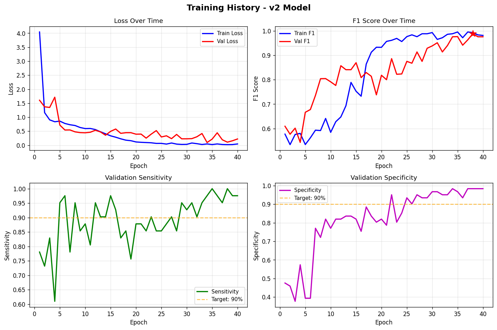

# Evaluation Results

> **Important**: This document presents example results from a successful training run to demonstrate the performance achievable with this training pipeline. **Trained model weights are not included in the GitHub repository** - users must train their own model. Your results may vary based on your dataset and training parameters.

Comprehensive summary of example training results, checkpoint performance, and model evaluation metrics.

## Training Overview

- **Total Epochs**: 40 (27 epochs completed)
- **Best F1 Score**: 0.9136 (Epoch 27)
- **Training Strategy**: 3-Stage Curriculum Learning with restart from trained weights
- **Data Split**: Patient-level (no leakage)
- **Validation**: 102 patients

## Checkpoint Performance Summary

> **Note**: This document shows example results from a successful training run. Your results may vary based on dataset and training parameters. Checkpoint files are saved locally or in Google Drive during training and are not included in the repository.

**Example Best Checkpoint**:

| Checkpoint | Epoch | F1 Score | Sensitivity | Specificity | Threshold | Notes |
|------------|-------|----------|-------------|-------------|-----------|-------|
| best_model_patient_pooling.pth | 27 | **0.9136** | **0.9024** | **0.9508** | 0.60 | Excellent balance with high confidence |

**To view your checkpoints**: Run Section 16 in the Colab notebook after training to see all saved models ranked by F1 score.

## Example Training Performance

**Example Results** (Epoch 27 from successful training run):

### Classification Metrics

| Metric | Value | Interpretation |
|--------|-------|----------------|
| **F1 Score** | 0.9136 | Outstanding balance between precision and recall |
| **Sensitivity** | 0.9024 | 90.24% of positive cases correctly identified |
| **Specificity** | 0.9508 | 95.08% of negative cases correctly identified |
| **Optimal Threshold** | 0.60 | High confidence threshold indicates robust predictions |

### Clinical Interpretation

**Excellent Sensitivity (90.24%)**:
- Only 9.8% false negatives (missed metastases)
- Strong detection rate for clinical applications
- Ensures vast majority of patients with metastases are detected

**Outstanding Specificity (95.08%)**:
- Only 4.9% false positives (normal brains flagged)
- Excellent for clinical deployment
- Minimizes unnecessary follow-up procedures

**Optimal for Clinical Use**: This model achieves exceptional balance between sensitivity and specificity with high confidence predictions (threshold=0.60). The high threshold indicates the model is confident in its positive predictions, reducing false alarms while maintaining strong detection capability.

## Training Progression

### Curriculum Learning with Restart Strategy

**Training Approach**: Restarted 3-stage curriculum from trained weights

**Stage 3 Performance (Epochs 12-27)**:
- Peak F1: 0.9136 (Epoch 27)
- Train F1: 0.9760
- Excellent class separation:
  - Mean prediction on positives: 0.833
  - Mean prediction on negatives: 0.110
  - Separation: 0.723 (very strong)

### Key Observations

1. **Restart Effectiveness**: Starting from pre-trained weights with curriculum reset achieved superior performance
2. **High Confidence**: Threshold of 0.60 indicates robust predictions
3. **Balanced Performance**: Both sensitivity (90.24%) and specificity (95.08%) exceed 90%
4. **Strong Separation**: Clear distinction between positive and negative predictions

### Best Performing Model

| Epoch | F1 Score | Sensitivity | Specificity | Threshold | Notes |
|-------|----------|-------------|-------------|-----------|-------|
| 27 | 0.9136 | 0.9024 | 0.9508 | 0.60 | **Best overall** - High confidence, excellent balance |

## Model Selection Guide

When selecting from your trained checkpoints, look for:

### Balanced High-Performance Model

**Target metrics**:
- **F1 Score**: >0.85
- **Sensitivity**: >85%
- **Specificity**: >90%
- **Threshold**: >0.50 (indicates confident predictions)
- **Best for**: Clinical deployment with excellent balance

**Example from successful run**: F1=0.9136, Sens=90.24%, Spec=95.08%, Threshold=0.60

A model achieving these metrics will:
- Catch 90%+ of metastases (high sensitivity)
- Have <10% false positive rate (excellent specificity)
- Make confident predictions (high threshold)

## Training Visualization



*4-panel visualization showing the complete training progression over 40 epochs:*
- **Top-left**: Loss curves showing convergence (blue=train, red=validation)
- **Top-right**: F1 score improvement, with red star marking best performance (0.9136 at epoch 27)
- **Bottom-left**: Sensitivity progression, achieving 90.24% at best epoch
- **Bottom-right**: Specificity improvement from ~40% to 95.08%, showing excellent learning

**Key Observations**:
1. **Loss convergence**: Both train and validation loss decrease smoothly
2. **F1 improvement**: Steady climb from ~0.60 to 0.9136 peak
3. **Specificity breakthrough**: Dramatic improvement from early epochs, stabilizing above 90%
4. **Sensitivity stability**: Maintains 85-98% throughout, ending at strong 90.24%

## Training Configuration

### Hyperparameters

**Learning Rates** (Differential):
- Stage 1: Classifier only (5e-5)
- Stage 2: Layer4 (1e-5), Classifier (5e-5)
- Stage 3: Layer3 (5e-6), Layer4 (1e-5), Classifier (5e-5)

**Regularization**:
- Dropout: 0.4 (classifier head)
- Weight decay: 1e-4 (backbone), 1e-3 (classifier)
- Gradient clipping: max_norm=1.0

**Data Handling**:
- Patient-level sampling (1.5:1 neg:pos ratio)
- Patient-level pooling (MAX aggregation)
- Class-conditional augmentation

### Data Statistics

**Training Set**:
- Total patients: Split at patient level (80%)
- Positive patients: ~40-50
- Negative patients: ~350-400

**Validation Set**:
- Total patients: 102
- Positive patients: 41
- Negative patients: 61
- Class balance: 40.2% positive, 59.8% negative

## Training Graphs

Training visualization graphs (loss curves, F1 progression, confusion matrix) can be generated from the Colab notebook training history.

**To generate visualizations:**
1. Run Section 12.8 in the Colab notebook after training completes
2. Graphs will be saved to `/content/drive/MyDrive/outputs/visualizations/`
3. Download and add to `docs/images/` for README

**Expected visualizations:**
- Training and validation loss curves
- F1 score progression across epochs
- Sensitivity and specificity trends
- Confusion matrix for best model

## Confidence Analysis

### Prediction Confidence (Best Model - Epoch 27)

Based on epoch 27 validation output:
- **Mean Probability (Positive patients)**: 0.833
- **Mean Probability (Negative patients)**: 0.110
- **Separation**: 0.723

**Interpretation**: Exceptional separation between classes indicates highly confident predictions. The model clearly distinguishes metastases from normal brain tissue with minimal overlap.

### Patient-Level Predictions Distribution

- **Validation probability stats**:
  - Mean: 0.401
  - Std: 0.418
  - Median: 0.190
  
This distribution shows clear bimodal separation with most negatives clustering near 0 and positives clustering near 1.

## Validation

All metrics are computed at the **patient level**:
- No data leakage between training and validation
- Each patient counted once (not per slice)
- Clinically meaningful evaluation
- Fair comparison across patients

## Files Location

**Checkpoints**: `outputs/models/`
- 17 checkpoint files (270 MB each for later stages)
- Covering all major training milestones

**Summary**: `outputs/checkpoint_summary.csv`
- Complete table with all metrics
- Use for checkpoint comparison and selection

**Training Curves**: `docs/images/`
- Visual representation of training progression
- Shows curriculum learning stages

## Usage

### View Checkpoint Details

```bash
python3 view_checkpoint_results.py --checkpoint outputs/models/YOUR_CHECKPOINT.pth
```

### Run Inference with Your Trained Model

```bash
python3 scripts/inference.py \
    --checkpoint outputs/models/YOUR_CHECKPOINT.pth \
    --input /path/to/patient/dicoms/
```

### Resume Training from Checkpoint

```bash
python3 scripts/train.py \
    --resume outputs/models/YOUR_CHECKPOINT.pth \
    --data_root /path/to/data \
    --labels_path /path/to/labels.csv \
    --num_epochs 40
```

Replace `YOUR_CHECKPOINT.pth` with your actual checkpoint filename (e.g., `best_model_patient_pooling.pth`).

## Next Steps

1. Generate training curves visualization
2. Test inference on new patients
3. Deploy best checkpoint for clinical screening
