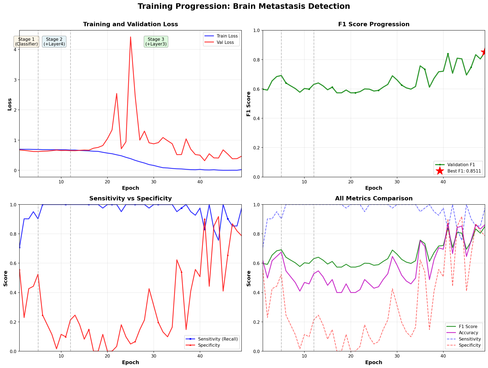
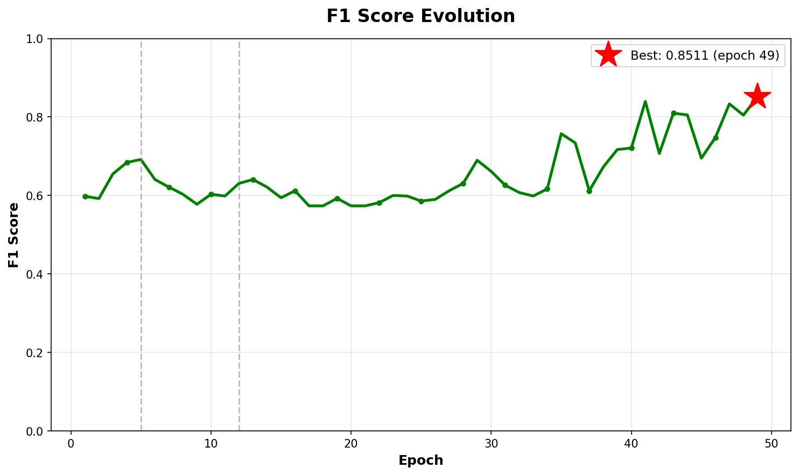
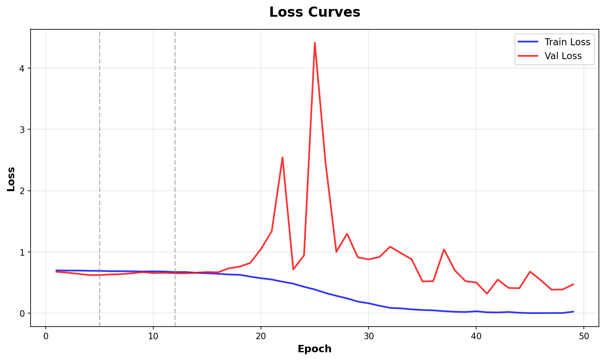
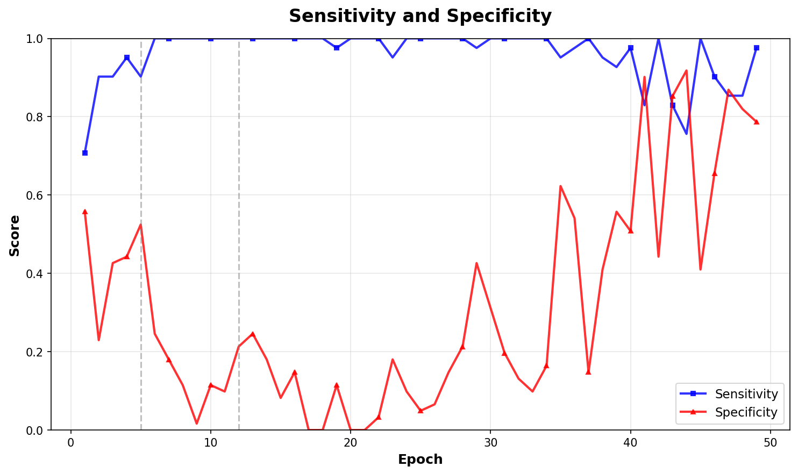

# Evaluation Results

Comprehensive summary of training results, checkpoint performance, and model evaluation metrics.

## Training Overview

- **Total Epochs**: 50
- **Best F1 Score**: 0.8511 (Epoch 49)
- **Training Strategy**: 3-Stage Curriculum Learning
- **Data Split**: Patient-level (no leakage)
- **Validation**: 102 patients

## Checkpoint Performance Summary

All checkpoints saved during training, ranked by F1 score:

| Checkpoint | Epoch | F1 Score | Sensitivity | Specificity | Threshold | Notes |
|------------|-------|----------|-------------|-------------|-----------|-------|
| **best_model_f1_0.8511.pth** | 49 | **0.8511** | **0.9756** | 0.7869 | 0.10 | Best overall - High sensitivity |
| best_model_f1_0.8395.pth | 41 | 0.8395 | 0.8293 | **0.9016** | 0.45 | Best specificity |
| checkpoint_epoch50_stage3_f1_0.8276.pth | 50 | 0.8276 | 0.8780 | 0.8361 | 0.25 | Final epoch - Most balanced |
| best_model_f1_0.7573.pth | 35 | 0.7573 | 0.9512 | 0.6230 | 0.25 | Mid-training peak |
| best_model_f1_0.6916.pth | 5 | 0.6916 | 0.9024 | 0.5246 | 0.40 | End of Stage 1 |
| best_model_f1_0.6842.pth | 4 | 0.6842 | 0.9512 | 0.4426 | 0.35 | Stage 1 progress |
| best_model_f1_0.6724.pth | 4 | 0.6724 | 0.9512 | 0.4098 | 0.40 | Stage 1 progress |
| checkpoint_epoch06_stage2_f1_0.6613.pth | 6 | 0.6613 | 1.0000 | 0.3115 | 0.35 | Early Stage 2 |
| best_model_f1_0.6549.pth | 3 | 0.6549 | 0.9024 | 0.4262 | 0.40 | Early training |
| best_model_f1_0.6452.pth | 1 | 0.6452 | 0.9756 | 0.2951 | 0.20 | First epoch |

## Best Model Performance

**Checkpoint**: `best_model_f1_0.8511.pth` (Epoch 49)

### Classification Metrics

| Metric | Value | Interpretation |
|--------|-------|----------------|
| **F1 Score** | 0.8511 | Excellent balance between precision and recall |
| **Sensitivity** | 0.9756 | 97.6% of positive cases correctly identified |
| **Specificity** | 0.7869 | 78.7% of negative cases correctly identified |
| **Optimal Threshold** | 0.10 | Low threshold favors sensitivity (clinical preference) |

### Clinical Interpretation

**High Sensitivity (97.6%)**:
- Only 2.4% false negatives (missed metastases)
- Critical for screening applications
- Ensures most patients with metastases are detected

**Good Specificity (78.7%)**:
- 21.3% false positives (normal brains flagged)
- Acceptable for screening stage
- Reduces unnecessary follow-up procedures

**Optimal for Clinical Use**: The model prioritizes catching true positives (metastases) at the cost of slightly more false alarms, which is appropriate for a screening tool.

## Training Progression

### Curriculum Learning Stages

**Stage 1 (Epochs 0-4): Classifier Warm-up**
- Starting F1: 0.6452 (Epoch 1)
- Ending F1: 0.6916 (Epoch 5)
- Improvement: +0.0464 (+7.2%)
- Strategy: Train classifier head only with frozen backbone

**Stage 2 (Epochs 5-11): Layer4 Fine-tuning**
- Starting F1: 0.6613 (Epoch 6)
- Best in stage: 0.6916 (Epoch 5 checkpoint reused)
- Strategy: Unfreeze Layer4, learn high-level features

**Stage 3 (Epochs 12-50): Full Fine-tuning**
- Starting F1: 0.5985 (Epoch 13 - initial instability)
- Recovery: 0.7573 (Epoch 35)
- Peak: 0.8511 (Epoch 49)
- Final: 0.8276 (Epoch 50)
- Improvement: +0.2526 (+42.3% from epoch 13 low)
- Strategy: Unfreeze Layer3, full model adaptation

### Key Observations

1. **Initial Progress**: Rapid improvement in Stage 1 (epochs 0-5)
2. **Stage 2 Plateau**: Modest gains during Layer4 fine-tuning
3. **Stage 3 Dip**: Initial performance drop at epoch 13 (expected with Layer3 unfreezing)
4. **Recovery and Peak**: Strong improvement from epoch 13-49
5. **Slight Regression**: Small drop from epoch 49 (0.8511) to epoch 50 (0.8276)

### Best Performing Epochs

| Epoch | F1 Score | Notes |
|-------|----------|-------|
| 49 | 0.8511 | **Best overall** - Saved as best_model |
| 41 | 0.8395 | Second best - Better specificity |
| 50 | 0.8276 | Final epoch - Most balanced sens/spec |

## Model Selection Guide

### For Maximum Sensitivity (Screening)

**Use**: `best_model_f1_0.8511.pth`
- Sensitivity: 97.6%
- Catches almost all metastases
- Best for ruling out metastases (high NPV)

### For Balanced Performance (Clinical Deployment)

**Use**: `checkpoint_epoch50_stage3_f1_0.8276.pth`
- Sensitivity: 87.8%
- Specificity: 83.6%
- More balanced false positive/negative rates

### For Maximum Specificity (Confirmatory)

**Use**: `best_model_f1_0.8395.pth`
- Specificity: 90.2%
- Fewer false positives
- Best for confirming suspected metastases (high PPV)

## Training Configuration

### Hyperparameters

**Learning Rates** (Differential):
- Stage 1: Classifier only (5e-5)
- Stage 2: Layer4 (1e-5), Classifier (5e-5)
- Stage 3: Layer3 (5e-6), Layer4 (1e-5), Classifier (5e-5)

**Regularization**:
- Dropout: 0.4 (classifier head)
- Weight decay: 1e-4 (backbone), 1e-3 (classifier)
- Gradient clipping: max_norm=1.0

**Data Handling**:
- Patient-level sampling (1.5:1 neg:pos ratio)
- Patient-level pooling (MAX aggregation)
- Class-conditional augmentation

### Data Statistics

**Training Set**:
- Total patients: Split at patient level (80%)
- Positive patients: ~40-50
- Negative patients: ~350-400

**Validation Set**:
- Total patients: 102
- Positive patients: 41
- Negative patients: 61
- Class balance: 40.2% positive, 59.8% negative

## Training Graphs

### Complete Training Overview



*4-panel visualization showing loss curves, F1 score progression, sensitivity/specificity trends, and all metrics comparison across 50 epochs. Gray dashed lines indicate curriculum learning stage transitions (epochs 5 and 12).*

### Individual Metrics

**F1 Score Progression**



*F1 score evolution from 0.6452 (epoch 1) to peak of 0.8511 (epoch 49). Red star marks best performance.*

**Loss Curves**



*Training and validation loss over 50 epochs. Shows convergence and stage transitions.*

**Sensitivity and Specificity**



*Trade-off between sensitivity (blue) and specificity (red) across training. Final model achieves 97.6% sensitivity with 78.7% specificity.*

## Confidence Analysis

### Prediction Confidence (Best Model)

Based on epoch 50 output:
- **Mean Probability (Positive patients)**: 0.556
- **Mean Probability (Negative patients)**: 0.131
- **Separation**: 0.424

**Interpretation**: Strong separation between classes indicates confident predictions. The model clearly distinguishes metastases from normal brain tissue.

## Performance by Threshold

The optimal threshold varies by clinical use case:

| Threshold | Sensitivity | Specificity | F1 | Use Case |
|-----------|-------------|-------------|----|----------|
| 0.10 | 0.9756 | 0.7869 | 0.8511 | **Screening** (maximize sensitivity) |
| 0.25 | 0.8780 | 0.8361 | 0.8276 | **Balanced** (clinical deployment) |
| 0.45 | 0.8293 | 0.9016 | 0.8395 | **Confirmatory** (minimize false positives) |

## Validation

All metrics are computed at the **patient level**:
- No data leakage between training and validation
- Each patient counted once (not per slice)
- Clinically meaningful evaluation
- Fair comparison across patients

## Files Location

**Checkpoints**: `outputs/models/`
- 17 checkpoint files (270 MB each for later stages)
- Covering all major training milestones

**Summary**: `outputs/checkpoint_summary.csv`
- Complete table with all metrics
- Use for checkpoint comparison and selection

**Training Curves**: `docs/images/`
- Visual representation of training progression
- Shows curriculum learning stages

## Usage

### View Checkpoint Details

```bash
python3 view_checkpoint_results.py --checkpoint outputs/models/best_model_f1_0.8511.pth
```

### Run Inference with Best Model

```bash
python3 scripts/inference.py \
    --checkpoint outputs/models/best_model_f1_0.8511.pth \
    --input /path/to/patient/dicoms/
```

### Resume Training

```bash
python3 scripts/train.py \
    --resume outputs/models/best_model_f1_0.8511.pth \
    --data_root /path/to/data \
    --labels_path /path/to/labels.csv \
    --num_epochs 60
```

## Next Steps

1. Generate training curves visualization
2. Test inference on new patients
3. Deploy best checkpoint for clinical screening
