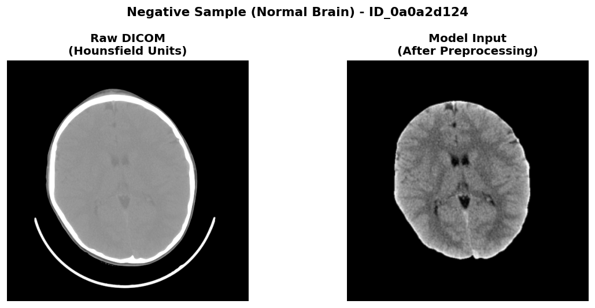
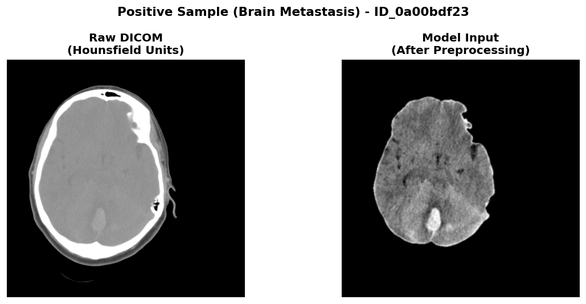
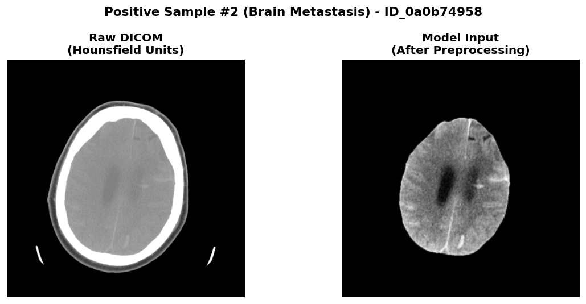
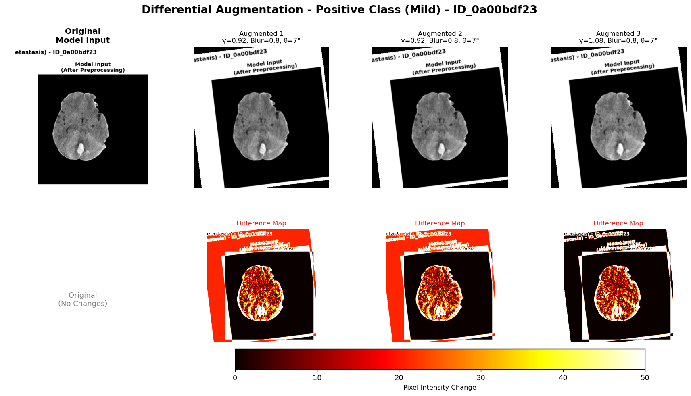
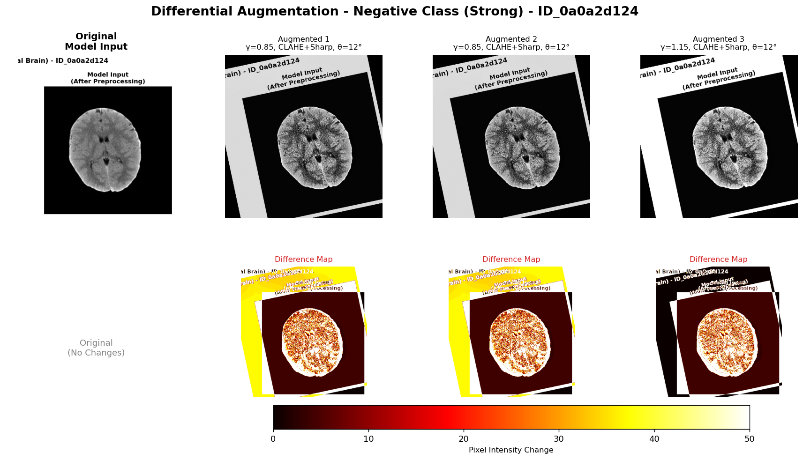

# Deep Learning for Clinical Neuro-Oncology

Deep learning pipeline for automated detection of brain metastases from CT scans using `ResNet-50` with `RadImageNet` pretraining.

## Overview

This project implements a patient-level classification system that detects brain metastases from head CT scans. The system uses a `ResNet-50` backbone pretrained on `RadImageNet` (1.35M medical images) and employs advanced training techniques including curriculum learning, class-conditional augmentation, and patient-level pooling.

### Key Innovation

**Patient-Level Training**: this system trains and evaluates at the patient level, preventing data leakage and ensuring clinically meaningful predictions.

## Preprocessing Pipeline

The pipeline transforms raw DICOM CT scans into normalized tensors through six stages: brain extraction, windowing, normalization, resizing, quality assessment, and class-conditional augmentation.

### Example: Negative Sample (Normal Brain)



*Side-by-side comparison showing the transformation from raw DICOM (Hounsfield Units) to the exact model input. Left: Original CT scan with skull, air spaces, and brain. Right: After brain extraction, windowing (40/80 HU), normalization, and resizing to 256x256 - this is what the model sees.*

**Key Features**:
- Bilateral symmetry maintained
- Homogeneous gray and white matter
- No focal lesions
- Smooth tissue texture

### Example: Positive Sample #1 (Brain Metastasis - High Asymmetry)



*Side-by-side comparison showing preprocessing pipeline. Left: Raw DICOM with focal lesion. Right: Model input after full preprocessing - the metastatic lesion appears as a focal hyperdense region with preserved diagnostic features. This sample shows clear left-right asymmetry.*

**Key Features**:
- Focal hyperdense lesion (bright spot)
- Clear asymmetry (unilateral presentation)
- Heterogeneous texture within lesion
- May show irregular margins

### Example: Positive Sample #2 (Brain Metastasis - Alternative Presentation)



*Another metastasis case showing different lesion characteristics and location. Demonstrates the variability in metastatic presentations that the model must handle.*

### Class-Conditional Augmentation Examples

The training pipeline applies **differential augmentation** based on class:
- **Positive samples** (metastasis): Mild augmentation to preserve lesion texture and boundaries
- **Negative samples** (normal brain): Strong augmentation (CLAHE, sharpening) to create harder negatives

**Positive Sample Augmentation (Mild)**



*Top row: Original model input + 3 augmented versions with mild transforms (γ=brightness adjustment, gentle blur). Bottom row: Difference heatmaps (red = changed pixels) showing minimal modification to preserve lesion features.*

**Negative Sample Augmentation (Strong)**



*Top row: Original model input + 3 augmented versions with strong transforms (γ=brightness adjustment, CLAHE local contrast enhancement, 2× sharpening). Bottom row: Difference heatmaps showing extensive modifications to create harder negative samples.*

### Preprocessing Steps Explained

1. **Brain Extraction**: Isolate brain tissue using HU thresholding (-50 to +100 HU) and morphological operations
2. **Windowing**: Apply brain window (center=40 HU, width=80 HU) to enhance soft tissue contrast
3. **Normalization**: Z-score normalization to standardize across scanners
4. **Resizing**: Resize to 256×256 for consistent model input
5. **Quality Assessment**: Filter low-quality slices while retaining asymmetric slices
6. **Augmentation**: Class-conditional augmentation applied during training

## Model Architecture

### ResNet50-ImageOnly

```
Input: Single-channel CT slice [1, 256, 256]
    ↓
Conv1 (modified for grayscale)
    ↓
ResNet Blocks (Layer 1-4)
    ↓
Global Average Pooling → [2048]
    ↓
Classifier: FC(2048→512) → ReLU → Dropout(0.4) → FC(512→1)
    ↓
Output: Logit (sigmoid → probability)
```

**Total Parameters**: 24.6M  
**Pretrained on**: `RadImageNet` (medical images)  
**Input**: Single-channel CT (grayscale)  
**Output**: Binary classification (metastasis present/absent)

### Patient-Level Prediction

Individual slices are aggregated to produce a single patient-level diagnosis:

```
Patient CT scan (30-50 slices)
    ↓
Process each slice through model → 30-50 logits
    ↓
MAX pooling → single patient logit
    ↓
Classification threshold → patient prediction
```

**Clinical Rationale**: If ANY slice shows metastasis, the patient is positive. MAX pooling is sensitive to small lesions that may appear in only a few slices.

## Training Strategy

### 3-Stage Curriculum Learning

Training progresses through three stages with automatic layer unfreezing:

**Stage 1 (Epochs 0-4): Classifier Warm-up**
- Frozen: All ResNet layers (conv1 through layer4)
- Trainable: Classifier head only (1.05M parameters)
- Learning rate: 5e-5
- Goal: Learn to use frozen `RadImageNet` features

**Stage 2 (Epochs 5-11): Layer4 Fine-tuning**
- Frozen: conv1 through layer3
- Trainable: Layer4 + Classifier (7.9M parameters)
- Learning rates: Layer4=1e-5, Classifier=5e-5
- Goal: Adapt high-level features for metastasis detection

**Stage 3 (Epochs 12-50): Full Fine-tuning**
- Frozen: conv1 through layer2
- Trainable: Layer3 + Layer4 + Classifier (14.9M parameters)
- Learning rates: Layer3=5e-6, Layer4=1e-5, Classifier=5e-5
- Goal: Full model adaptation with differential learning

### Class-Conditional Augmentation

Different augmentation strategies are applied based on sample class:

**Positive Samples (Metastases)**:
- Augmentation probability: 70%
- Mild gamma correction (0.95-1.05)
- Gaussian blur (preserve lesion texture)
- Goal: Maintain diagnostic heterogeneous appearance

**Negative Samples (Normal Brain)**:
- Augmentation probability: 50%
- Strong gamma correction (0.9-1.1)
- CLAHE (local contrast enhancement)
- Sharpening filters (accentuate edges)
- Goal: Make negatives harder, prevent overfitting to uniform appearance

## Installation

```bash
# Clone repository
git clone <repository-url>
cd Deep_Learning_for_Clinical_Neuro_Oncology

# Install dependencies
pip install -r requirements.txt

# Or install as package
pip install -e .
```

### RadImageNet Pretrained Weights

The model uses **`RadImageNet-ResNet50`** pretrained weights from HuggingFace (`microsoft/RadImageNet-ResNet50`).

**Automatic Download** (recommended):
- Weights will automatically download on first training/inference run (~100 MB)
- Cached in `~/.cache/huggingface/hub/`

**Manual Download** (optional):
```python
from huggingface_hub import hf_hub_download
weights_path = hf_hub_download(
    repo_id="microsoft/RadImageNet-ResNet50",
    filename="pytorch_model.bin"
)
```

### Requirements

- Python 3.8+
- PyTorch 2.0+
- CUDA-capable GPU (recommended)
- Internet connection (for first-time `RadImageNet` download)
- See `requirements.txt` for complete list

## Quick Start

### 1. Prepare Data

Organize your data:
```
/path/to/data/brain_metastases/
├── CTs/
│   ├── patient_001/
│   │   ├── slice_001.dcm
│   │   ├── slice_002.dcm
│   │   └── ...
│   ├── patient_002/
│   └── ...
└── labels1.csv
```

### 2. Train Model

```bash
python scripts/train.py \
    --data_root /path/to/brain_metastases/CTs \
    --labels_path /path/to/brain_metastases/labels1.csv \
    --output_path ./outputs \
    --num_epochs 50 \
    --batch_size 32
```

Training will automatically:
- Split data at patient level (80/20)
- Apply 3-stage curriculum learning
- Save checkpoints at key milestones
- Print metrics after each epoch

### 3. Run Inference

**Single patient**:
```bash
python scripts/inference.py \
    --checkpoint ./outputs/models/best_model_f1_0.8511.pth \
    --input /path/to/patient/dicoms/
```

**Batch processing**:
```bash
python scripts/inference.py \
    --checkpoint ./outputs/models/best_model_f1_0.8511.pth \
    --input /path/to/all/patients/ \
    --output predictions.csv \
    --batch_process
```

## Project Structure

```
Deep_Learning_for_Clinical_Neuro_Oncology/
├── scripts/              # Command-line tools
│   ├── train.py          # Training pipeline
│   ├── inference.py      # Prediction
│   ├── preprocess_data.py  # Data caching
│   └── test_installation.py  # Verify setup
├── config/               # Configuration
│   └── config.py         # All hyperparameters
├── src/
│   ├── models/          # `ResNet50_ImageOnly`
│   ├── preprocessing/   # Brain extraction, windowing
│   ├── data/            # Dataset, PatientSampler
│   └── utils/           # Metrics and visualization
├── docs/                # Technical documentation
│   ├── ARCHITECTURE.md
│   ├── PREPROCESSING.md
│   ├── PATIENT_LEVEL_TRAINING.md
│   ├── PROJECT_STRUCTURE.md
│   ├── QUICK_START.md
│   └── images/          # Preprocessing examples and training graphs
├── outputs/             # Training results
│   ├── models/          # Saved checkpoints
│   └── checkpoint_summary.csv
├── setup.py
├── requirements.txt
├── EVALUATION_RESULTS.md
├── CHECKPOINT_STRUCTURE.md
└── README.md
```

## Configuration

All hyperparameters are centralized in `config/config.py`.

### Key Configuration Options

**Training**:
- `num_epochs`: 50 (default)
- `batch_size`: 32 slices per batch
- Learning rates: Classifier=5e-5, Layer4=1e-5, Layer3=5e-6
- Gradient clipping: max_norm=1.0

**Augmentation**:
- Positive probability: 70%
- Negative probability: 50%
- CLAHE enabled for negatives
- Sharpening enabled for negatives

See `config/config.py` for all options with detailed docstrings.

## Checkpoints

Training saves 10+ checkpoint files at key milestones:

1. **Best Model** (F1 = 0.8511 at epoch 49):
   - `best_model_f1_0.8511.pth` - **Recommended for deployment**
   - Sensitivity: 97.6%, Specificity: 78.7%

2. **Alternative Checkpoints**:
   - `best_model_f1_0.8395.pth` (epoch 41) - Best specificity (90.2%)
   - `checkpoint_epoch50_stage3_f1_0.8276.pth` - Final epoch, most balanced
   - `best_model_f1_0.7573.pth` (epoch 35) - Mid-training peak
   - `best_model_f1_0.6916.pth` (epoch 5) - End of Stage 1

Each checkpoint contains model weights, optimizer state, metrics, optimal threshold, and complete training history.

See `EVALUATION_RESULTS.md` for complete checkpoint comparison and `CHECKPOINT_STRUCTURE.md` for detailed documentation.

## Performance

### Training Results (50 epochs)

**Best Model** (`best_model_f1_0.8511.pth` - Epoch 49):
- **F1 Score**: 0.8511
- **Sensitivity**: 97.56% (only 2.4% false negatives)
- **Specificity**: 78.69% (21.3% false positives)
- **Optimal Threshold**: 0.10

**Alternative Models**:
- **Highest Specificity**: 90.16% (`best_model_f1_0.8395.pth` - Epoch 41)
- **Most Balanced**: F1=0.8276, Sens=87.8%, Spec=83.6% (Final epoch 50)

### Training Characteristics

- **Hardware**: Trained on GPU
- **Evaluation**: Patient-level metrics (102 patients)
- **Data split**: 80/20 train/validation at patient level
- **Checkpoints**: 10+ files saved during training

See `EVALUATION_RESULTS.md` for complete training graphs and detailed analysis.

## Patient-Level Training

This project uses patient-level training methodology:

**Key Features**:
- Data split at patient level (no leakage between train/val)
- Custom PatientSampler groups all slices from same patient
- MAX pooling aggregates slice predictions to patient level
- Loss computed once per patient (fair contribution)
- Metrics evaluated at patient level (clinical accuracy)

See `docs/PATIENT_LEVEL_TRAINING.md` for complete explanation.

## Documentation

### Technical Documentation

- **`docs/ARCHITECTURE.md`**: Model architecture, curriculum learning, loss function
- **`docs/PREPROCESSING.md`**: Complete preprocessing pipeline and augmentation strategies
- **`docs/PATIENT_LEVEL_TRAINING.md`**: Patient-level methodology and implementation
- **`docs/PROJECT_STRUCTURE.md`**: Code organization and extension points
- **`docs/QUICK_START.md`**: Quick start guide with examples

### Evaluation and Results

- **`EVALUATION_RESULTS.md`**: Complete training results with metrics table and graphs
- **`CHECKPOINT_STRUCTURE.md`**: Checkpoint system and loading

### API Documentation

All Python code includes comprehensive docstrings:
- Every function documents parameters, returns, and usage
- Every class includes purpose and examples
- Type hints throughout for clarity

## Advanced Usage

### Resume Training

```bash
python scripts/train.py \
    --data_root /path/to/data \
    --labels_path /path/to/labels.csv \
    --resume ./outputs/models/best_model_f1_0.8395.pth
```

### Custom Configuration

Modify `config/config.py` for experiment tracking.

### Preprocessing Only

Cache preprocessed data before training:

```bash
python scripts/preprocess_data.py \
    --data_root /path/to/dicoms \
    --labels_path /path/to/labels.csv \
    --output_path ./preprocessed_data
```

Speeds up subsequent training runs significantly.

## Scientific Background

### Why Patient-Level Training?

Traditional slice-level training has critical flaws:
- Data leakage: Same patient in train and validation
- Biased loss: Patients with more slices dominate training
- Unrealistic evaluation: Slice-level metrics don't reflect clinical performance

**Solution**: Patient-level training ensures no data leakage, fair loss computation, and clinically meaningful evaluation.

### Why Class-Conditional Augmentation?

Brain metastases show heterogeneous texture (diagnostic feature), while normal brain appears homogeneous. Applying the same augmentation to both classes can:
- Destroy diagnostic texture in metastases
- Make normal brain too easy to classify

**Solution**: Mild augmentation for positives (preserve texture), strong augmentation for negatives (make harder).

### Why MAX Pooling?

Clinical reasoning: If ANY slice shows metastasis, the patient has metastasis. MAX pooling is sensitive to rare positive findings and not diluted by many negative slices.

### Why Curriculum Learning?

Fine-tuning all layers from the start can cause:
- Catastrophic forgetting of pretrained features
- Training instability
- Poor convergence

**Solution**: Progressive unfreezing allows the classifier to stabilize before adapting deeper layers.


## Related Projects

### L3 Vertebra Localization

A companion project for automated localization of the L3 vertebra in CT scans, used for body composition analysis and sarcopenia assessment. Located in `../Localization_L3_Vertebra/`.

**Problem**: Identify the exact slice position of the L3 vertebra in abdominal/chest CT scans for standardized cross-sectional area measurements.

**Two Approaches Proposed**:

1. **Approach 1 - Segmentation + Numbering**: Four-stage pipeline that segments all vertebrae, orders them anatomically, and identifies L3 based on anatomical sequence. Best for when full vertebra segmentation is needed and anatomical interpretability is important.

2. **Approach 2 - Coarse-to-Fine**: Two-stage direct prediction using lightweight coarse localization followed by precise fine localization. More efficient, requires only slice-level annotations (not full segmentation masks).

Both approaches implement patient-level data handling to prevent data leakage from sequential CT slices. See approach documents for detailed architecture and mathematical formulations.

## Acknowledgments

- `RadImageNet` pretrained weights from HuggingFace (`microsoft/RadImageNet-ResNet50`)
- `ResNet-50` architecture from torchvision
- Preprocessing techniques adapted from clinical radiology best practices

## Additional Resources

### Documentation
- Full architecture details: `docs/ARCHITECTURE.md`
- Preprocessing pipeline: `docs/PREPROCESSING.md`
- Patient-level methodology: `docs/PATIENT_LEVEL_TRAINING.md`
- Quick start guide: `docs/QUICK_START.md`

### Evaluation Results
- Complete training analysis: `EVALUATION_RESULTS.md`
- Checkpoint comparison table
- Training graphs (loss, F1, sensitivity, specificity)
- Clinical interpretation of metrics

### Code Examples
- Training script: `scripts/train.py`
- Inference script: `scripts/inference.py`
- Configuration: `config/config.py`
- View checkpoint utility: `view_checkpoint_results.py`

### Guides
- Checkpoint system: `CHECKPOINT_STRUCTURE.md`
